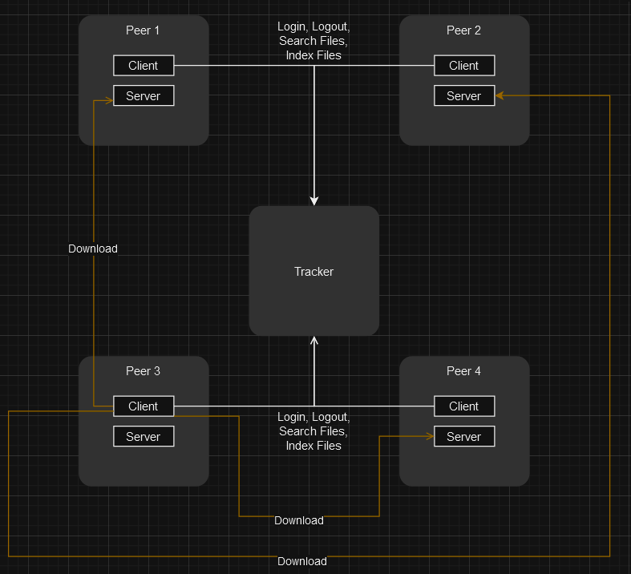

# Info de la materia: st0263 <nombre>
#
# Estudiante(s): Andres Camilo Alvarez Vasquez, acalvarezv@eafit.edu.co
#
# Profesor: Alvaro Ospina, aeospinas@eafit.edu.co

# P2P - Comunicación entre procesos mediante API REST, RPC y MOM
#
# 1. Breve descripción de la actividad
#
<texto descriptivo>

## 1.1. Que aspectos cumplió o desarrolló de la actividad propuesta por el profesor (requerimientos funcionales y no funcionales)
Se desarrollo un sistema orientado a una red P2P. Donde se cumplio con los requerimientos funcionales y no funcionales propuestos por el profesor. Se implemento un servidor tracker que sirve como punto de consulta para conocer la ubicacion de los demas peer y tienes servicios como de login, logout de los peers y indexacion de los archivos de cada peer. Por otro lado se implemento un peer que se encarga de conectarse al tracker y compartir su ubicacion para que los demas peers puedan conectarse a el, ademas enviar el nombre de todos los archivos que contiene en el metodo de indexacion del tracker. Ademas se hizo el uso de docker para integrar y simular una red P2P con multiples peers y un tracker. 

## 1.2. Que aspectos NO cumplió o desarrolló de la actividad propuesta por el profesor (requerimientos funcionales y no funcionales)
Se cumplio de manera existosa con todos los requerimientos propuestos por el profesor en conversaciones tenidas en clase y en el enunciado de la actividad.

# 2. Información general de diseño de alto nivel, arquitectura, patrones, mejores prácticas utilizadas.


Se utilizo una arquitectura P2P, donde el servidor es el tracker y los clientes son los peers. El tracker se encarga de recibir las peticiones de los peers y responderlas con la informacion necesaria para que los peers puedan conectarse entre si. Sin embargo se debe tener en cuenta que los peers se pueden comportar como servidores y clientes al mismo tiempo, ya que pueden recibir peticiones de otros peers y a la vez enviar peticiones a otros peers.



Cabe aclarar que los peers estan en la capacidad de conectarse a cualquier otro peer de la red. En el diagrama se obvia este detalle para no ensuciar el diagrama con tantas flechas.


Adicionalmente se agrega los servicios expuestos de cada uno de los componentes de la arquitectura.


Atraves del contrato definido con gRPC el tracker expone los metodos de login, logout, buscada de archivos y indexacion de archivos. Por otro lado el hace peer uso del contrato para consusmir los metodos y hacer el papel de cliente. 


# 3. Descripción del ambiente de desarrollo y técnico: lenguaje de programación, librerias, paquetes, etc, con sus numeros de versiones.

El lenguaje de programación utilizado fue Node.js, se utilizo el framework express para el desarrollo del servidor y el cliente peer. Ademas se utilizo el paquete grpc para la comunicacion entre el tracker y los peers. El servidor del tracker se creo haciendo uso de la libreria de GRPC y el cliente peer se creo haciendo uso de la libreria de GRPC y express, dado que el peer debe tener un servidor http para recibir las peticiones de los demas peers.

## Como se compila y ejecuta.

Para compilar y ejecutar el proyecto se debe hacer uso de docker y docker-compose. Se debe tener instalado docker y docker-compose en el equipo. Luego se debe clonar el repositorio y ejecutar el siguiente comando en la raiz del proyecto:

```bash
docker network create --subnet=172.20.0.0/28 mynet
```

En este caso de ejemplo nombramos la red como `mynet` tener en cuenta que el nombre puede ser cualquiera, pero debe concordar con el nombre de la red en el archivo `./peer/docker-compose.yml` y `./ptracker/docker-compose.yml`.

Cuando ya se tenga la red creada se debe ejecutar el siguiente comando en cada componente del proyecto para levantar el tracker y el conjunto de peers, todo esto estara conectado en una misma red lo que facilita en gran medida la comunicacion entre los componentes para la simulacion del ambiente en local.

```bash
cd ptracker
docker-compose up --build
```

Primero debemos levantar el tracker y luego los peers, para que los peers puedan conectarse al tracker. 
Ahora nos paramos en la raiz del proyecto de nuevo y luego
```bash
cd peer
docker-compose up --build

```

Con lo anterior ya seria suficiente.

Tanto el tracker como el peer tienen un sistema de loguer que permite ver de manera mas clara el comportamiento de los componentes. 
Dentro del tracker se puede observar el loguer en la consola de la terminal donde se ejecuta el comando de levantar el tracker.
Alli se puede observar el puerto en que corre el tracker y conforme cada peer se conecta al tracker se puede observar el loguer de la conexion del peer al tracker, luego se evidencia el loguer de la indexacion de los archivos del peer, a cada peer se le asigna un id unico, cada archivo tiene una lista de peers que lo contienen y el tracker tiene una lista de los peers que estan conectados a el.

Por otro lado, el peer tiene un loguer que se puede observar en la consola de la terminal donde se ejecuta el comando de levantar el peer. Alli se puede observar el puerto en que corre el peer y conforme el peer se conecta al tracker se puede observar el loguer de la conexion del peer al tracker, luego cuando se busca descargar un archivo se ve el loguer de la busqueda del archivo y la descarga del archivo.

## Dependencias

Dado que se esta usando docker para la simulacion de la red P2P, no se tiene que instalar ninguna dependencia en el equipo, dado que todo se ejecuta en contenedores de docker. Sin embargo se debe tener instalado docker y docker-compose en el equipo.

En caso de querer entender cada componente que paquetes usa se puede obsercar en el archivo `package.json` en el apartado de dependncias de cada uno de los componentes del proyecto.


## Detalles del desarrollo.
A nivel del desarrollo al principio se tuvieron problemas con el desarrollo de la arquitectura propuesta dado a la carencia de conocimiento para la implementacion de algunos conceptos como lo es el gRPC, por lo cual se tuvo que hacer una investigacion previa para poder entender como se podia implementar el contrato de comunicacion entre el tracker y los peers. Ademas se tuvo que hacer una investigacion previa para entender como se podia hacer uso de docker para simular una red P2P con multiples peers y un tracker.

A nivel de codigo se implemento un fake repository para simular la base de archivos de cada peer, en donde cada peer genera un conjunto de nombres de archivos de manera aleatoria con el fin de hacer una mejor simulacion del comportamiento de un peer en la red P2P. 

Tambien al peer y tracker se le implemento un sistema de loguer con el fin de poder dar trazabilidad da los eventos y ver de manera mas clara el comportamiento de los componentes. 


Las funcionalidades del tracker y el peer se implementaron de manera secuencial, primero se implemento el tracker y luego el peer. Se opto por esta estrategia dado que el tracker es el punto central de la red P2P y es el que se encarga de informar a un peer la ubicacion de los demas peers, por lo cual se opto por implementar primero el tracker y luego el peer.

Cuando ya se tuvo el tracker creado se procedio hacer las prubas del mismo y luego se procedio con la creacion del peer. Se opto por esta estrategia dado que el peer es el que se encarga de conectarse al tracker y compartir su ubicacion para que los demas peers puedan conectarse a el.

Por ultimo cuando ya se probo todo el sistema se procedio a hacer la integracion de docker para simular una red P2P con multiples peers y un tracker. Se opto por esta estrategia dado que se queria simular una red P2P con multiples peers y un tracker y se queria hacer uso de docker para hacer la simulacion de la red P2P.


## Detalles técnicos
Dentro de la solucion planteada se opto por el uso de Node.Js dado que es un lenguaje de programacion que se puede usar para el desarrollo de aplicaciones de red escalables, trabaja bien para procesos concurrentes como se pide en la actividad. Ademas se opto por el uso de GRPC dado que es un framework de comunicacion de alto rendimiento que permite la comunicacion entre diferentes lenguajes de programacion.
Para la comunicacion entre el tracker y los peers se uso el protocolo de GRPC, el cual es un protocolo de comunicacion de alto rendimiento que permite la comunicacion entre diferentes lenguajes de programacion. Ademas se uso el protocolo de HTTP para la comunicacion entre los peers, dado que es un protocolo que se puede usar para la comunicacion entre diferentes lenguajes de programacion y es ampliamente usado en el desarrollo de aplicaciones web.

Tambien se hizo uso de express para el desarrollo del servidor y el cliente peer, dado que es un framework de node.js que se puede usar para el desarrollo de aplicaciones web y es ampliamente usado.

Dentro del tracker opte por el uso de la libreria UUID para la generacion de los id de los peers, dado que es una libreria que se puede usar para la generacion de id unicos.

Por ultimo se uso docker para la simulacion de la red P2P con multiples peers y un tracker, dado que es una herramienta que se puede usar para la creacion de contenedores.


## Descripción y como se configura los parámetros del proyecto (ej: ip, puertos, conexión a bases de datos, variables de ambiente, parámetros, etc)

A nivel de base de datos no se tiene una conexion con base de datos como tal, los archivos que se indexan en el tracker son guardados en memoria, por lo cual no se tiene que configurar ninguna conexion a base de datos. Ademas los archivos de cada peer son mockeados y generados en tiempo de ejecucion. 
Por otro lado, gracias al uso de docker compose se puede configurar el puerto de cada uno de los servicios, el cual se puede configurar en el archivo docker-compose.yml. Ademas se puede configurar el numero de peers que se quieren simular en la red P2P, el cual se puede configurar en el archivo docker-compose.yml. Siendo este archivo el punto central para la configuracion de la red P2P.

## opcional - detalles de la organización del código por carpetas o descripción de algún archivo. (ESTRUCTURA DE DIRECTORIOS Y ARCHIVOS IMPORTANTE DEL PROYECTO, comando 'tree' de linux)


El codigo tambien esta estructurado de manera que se pueda hacer uso de docker para simular una red P2P con multiples peers y un tracker. Ademas dentro del peer y tracker se tiene una estructura parecida a la de un proyecto de node.js, con el fin de que sea mas facil de entender y de mantener. Se tiene los controladores, repositorios, rutas y inicializacion del servidor. Se orienta a una arquitectura por capas.


## opcionalmente - si quiere mostrar resultados o pantallazos 


Ejemplo de la ejecucion de tracker con el docker compose en donde se evidencia la ejecucion y levantamiento del tracker

Ejemplo de la ejecucion de peer con el docker compose en donde se evidencia la ejecucion y levantamiento del peer, ademas se evidencia la conexion del peer al tracker y la indexacion de los archivos del peer. Tambien cada peer obtiene un identificador unico. `peerIdentifier`.

Aqui se puede ver los loguers del login y indexacion cuando se hizo el levantamiento de los 4 peers, se puede notar como el tracker asigna un id unico a cada peer y como el tracker indexa los archivos de cada peer.
Podemos notar la presencia de 4 peers en la red P2P. Tambien podemos notar que cada archivo tiene relacionado un peer en donde se encuentra, mas adelante veremos como cambia esto cuando otro peer descarga un mismo archivo


En este ejemplo se puede notar la busqueda de un archivo haciendo uso de Postman, en donde el flujo de proceso es el siguiente:
1. Se hace una peticion al peer desde postman para buscar un archivo, en este caso se busca el archivo `qJe1TXQT`.
2. El peer recibe la peticion y manda la busqueda al tracker para que le informe quien contiene este archivo. 
3. En la parte inferior derecha de la imagen se puede ver como el tracker recibe la busqueda y responde con una lista vacia de urls de peers.
4. El peer recibe la respuesta del tracker y responde con un mensaje de que no se encontro el archivo.


En este ejemplo se puede notar la busqueda de un archivo haciendo uso de Postman, en donde el flujo de proceso es el siguiente:
1. Se hace una peticion al peer desde postman para buscar un archivo, en este caso se busca el archivo `Jox5cRmo`.
2. El peer recibe la peticion y manda la busqueda al tracker para que le informe quien contiene este archivo.
3. El tracker le responde al peer con una lista de urls de peers que contienen el archivo.
4. El peer escoje un peer de la lista y le hace una peticion para descargar el archivo. En la parte inferior de la imagen se observa de color verde el peer3 quien quiere desscargar el archivo del peer1. 
5. El peer1 recibe la peticion, obtiene el archivo de su sistema y lo envia al peer3. En la parte inferior de la imagen se observa de color verde el peer3 quien recibe el archivo del peer1.
6. El peer3 recibe el archivo y lo guarda en su sistema de archivos como se puede notar, ahora este peer tiene 3 archivos. Los 2 archivos iniciales y el archivo que descargo del peer1.
7. El peer3 vuelve a indexar sus archivos al tracker para que los demas peers sepan que archivos tiene.
8. En la parte superior derecha de la imagene se puede observar que ahora el archivo `Jox5cRmo` tiene relacion tanto con el peer1 como con el peer3, dado que el peer3 descargo el archivo del peer1.
9. Por ultimo, en la respuesta que recibe el postman se informa que el archivo fue descargado con exito y de donde se descargo.


# 5. otra información que considere relevante para esta actividad.

# referencias:

## Url de donde tomo info para desarrollar este proyecto
* https://blog.logrocket.com/creating-a-crud-api-with-node-express-and-grpc/
* https://blog.logrocket.com/communicating-between-node-js-microservices-with-grpc/
* https://grpc.io/docs/languages/node/basics/
* https://www.youtube.com/watch?v=bKFMS5C4CG0
* https://docs.docker.com/compose/